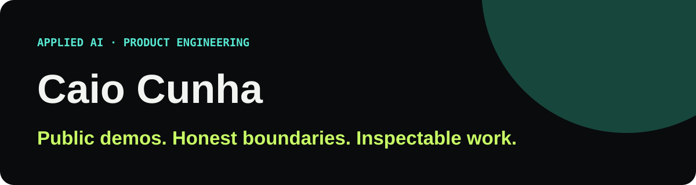

# Caio Cunha

**I build practical AI products, browser automations, and data systems—and publish safe ways to inspect how they work.**

[Explore the portfolio](https://caio-felice-cunha.github.io/CaioFeliceCunha.github.io/) · [Try DrumAI](https://caio-felice-cunha.github.io/drumai-demo/) · [Read its engineering case](https://caio-felice-cunha.github.io/drumai-demo/#case-study) · [Connect on LinkedIn](https://www.linkedin.com/in/caio-felicio-cunha/)

## Six projects to start with

| Project | Public state | Try it | Inspect the engineering |
| --- | --- | --- | --- |
| **Redax Juris** | Replay demo · release gate pending | [Product site](https://redaxjuris.com) | Public case remains blocked by credential rotation. |
| **Voxpage** | Replay demo · release gate pending | [Product site](https://voxpage.app) | Public case remains blocked by credential rotation. |
| **DrumAI** | Interactive demo | [Edit and play the chart](https://caio-felice-cunha.github.io/drumai-demo/) | [Pipeline, score model, Web Audio, privacy, tests](https://caio-felice-cunha.github.io/drumai-demo/#case-study) · [Source](https://github.com/Caio-Felice-Cunha/drumai-demo) |
| **LinkedIn / X Scheduler** | Interactive demo | [Replay a sample week](https://caio-felice-cunha.github.io/linkedin-x-scheduler/) | [Manifest, adapters, state, verification, safety](https://caio-felice-cunha.github.io/linkedin-x-scheduler/#architecture) · [Source](https://github.com/Caio-Felice-Cunha/linkedin-x-scheduler) |
| **Supply Chain Intelligence Hub** | Local runnable | [Filter the 101,786-row dashboard](https://caio-felice-cunha.github.io/Supply-Chain-Intelligence-Hub/) | [Pipeline, KPIs, lineage, quality, SQL](https://caio-felice-cunha.github.io/Supply-Chain-Intelligence-Hub/#engineering) · [Source](https://github.com/Caio-Felice-Cunha/Supply-Chain-Intelligence-Hub) |
| **MorarFora** | Live product | [Test the two guided flows](https://caio-felice-cunha.github.io/morarfora-case-study/) | [Astro, versioned data, UX, updates, tests](https://caio-felice-cunha.github.io/morarfora-case-study/#case) · [Source](https://github.com/Caio-Felice-Cunha/morarfora-case-study) |

Redax Juris and Voxpage remain unlinked to public case repositories until their historical credential-rotation gates are complete. Their private product source is not part of this showcase.

## More public demos

- **Scoopy:** [try the complete website](https://caio-felice-cunha.github.io/scoopy-demo/) · [inspect the 3D narrative and deterministic catalog](https://caio-felice-cunha.github.io/scoopy-demo/case-study/) · [source](https://github.com/Caio-Felice-Cunha/scoopy-demo)
- **Instagram Reels Poster:** [replay the zero-write batch](https://caio-felice-cunha.github.io/instagram-reels-poster/) · [inspect caption verification, pacing, and resume](https://caio-felice-cunha.github.io/instagram-reels-poster/#architecture) · [source](https://github.com/Caio-Felice-Cunha/instagram-reels-poster)
- **YouTube Shorts Scheduler:** [replay upload and scheduling](https://caio-felice-cunha.github.io/youtube-shorts-scheduler/) · [inspect audience, visibility, readback, and wrong-time prevention](https://caio-felice-cunha.github.io/youtube-shorts-scheduler/#architecture) · [source](https://github.com/Caio-Felice-Cunha/youtube-shorts-scheduler)

## What I work across

- Applied AI products with explicit cost, privacy, and human-review boundaries
- Data pipelines and evidence-oriented analytics
- Browser automation with safe offline adapters
- Product decisions in regulated or high-context domains

Currently a Data & Research Analyst at [Aterio](https://www.aterio.io) in Vancouver. My background spans business consulting, finance, law, data engineering, and software delivery.

## Principles behind this showcase

- Demo claims are backed by public evidence.
- Public demos require no account, API key, payment, or browser extension.
- Demo modes never publish or write to an external service.
- Private product code, customer material, and personal datasets stay private.

[Portfolio](https://caio-felice-cunha.github.io/CaioFeliceCunha.github.io/) · [LinkedIn](https://www.linkedin.com/in/caio-felicio-cunha/) · [X](https://x.com/Caio__Cunha)

